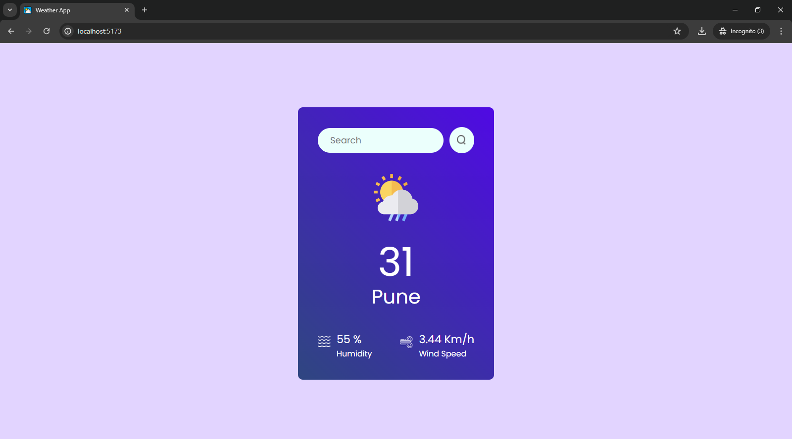

# Weather App

A web-based weather application built using React and CSS.

## Description

The Weather App is a simple yet powerful application that provides real-time weather information for any location worldwide. Users can search for a city to get current weather details including temperature, humidity, wind speed, and weather conditions.

## Features

- Real-time weather updates
- Search for weather information by city
- Responsive design
- Easy-to-use interface

## Installation

To get started with the Weather App, follow these steps:

1. **Clone the repository:**
   \`\`\`sh
   git clone https://github.com/kaustubh-01/weather-app.git
   \`\`\`
2. **Navigate to the project directory:**
   \`\`\`sh
   cd weather-app
   \`\`\`
3. **Install the dependencies:**
   \`\`\`sh
   npm install
   \`\`\`
4. **Start the development server:**
   \`\`\`sh
   npm start
   \`\`\`

## Usage

After starting the development server, open your web browser and go to \`http://localhost:3000\`. Enter the name of a city in the search bar to get the current weather information for that location.

### User Interface

The user interface of the Weather App includes the following elements:

- **Search Bar:** Allows users to enter the name of a city to retrieve weather information.
- **Weather Icon:** Displays an icon representing the current weather condition.
- **Temperature:** Shows the current temperature of the searched city.
- **City Name:** Displays the name of the searched city.
- **Humidity:** Shows the current humidity level.
- **Wind Speed:** Displays the current wind speed.

## Contributing

Contributions are welcome! To contribute to the project, follow these steps:

1. **Fork the repository:**
   Click the "Fork" button at the top right of this page.
2. **Clone your fork:**
   \`\`\`sh
   git clone https://github.com/kaustubh-01/weather-app.git
   \`\`\`
3. **Create a branch for your feature or bug fix:**
   \`\`\`sh
   git checkout -b feature-name
   \`\`\`
4. **Make your changes and commit them:**
   \`\`\`sh
   git commit -m 'Add some feature'
   \`\`\`
5. **Push to the branch:**
   \`\`\`sh
   git push origin feature-name
   \`\`\`
6. **Create a new Pull Request:**
   Go to the original repository on GitHub and click the "New Pull Request" button.

## License

This project is licensed under the MIT License. See the [LICENSE](LICENSE) file for details.

## Authors and Acknowledgments

- **Author:** [Kaustubh Salegaonkar](https://github.com/kaustubh-01)
- **Acknowledgments:** Thanks to the contributors of the project and the open-source community for their valuable inputs.

## Contact Information

For any questions or suggestions, feel free to contact me at [kaustubh.salegaonkar@gmail.com](mailto:kaustubh.salegaonkar@gmail.com).
